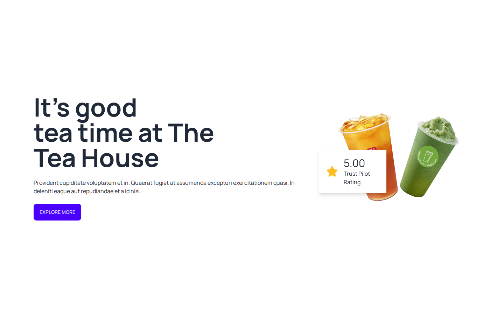
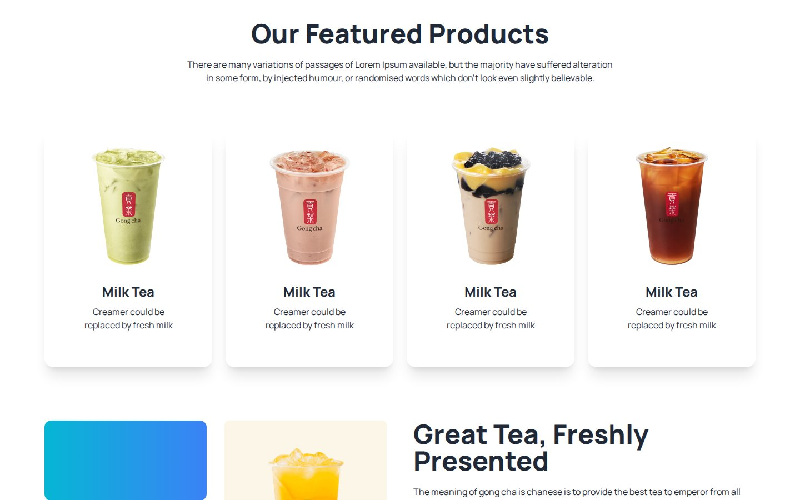
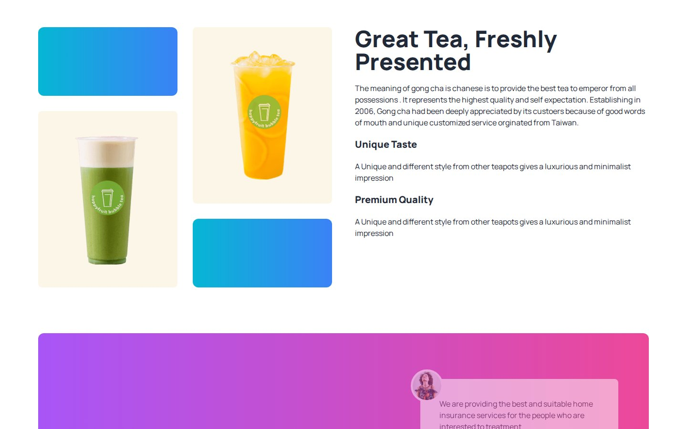
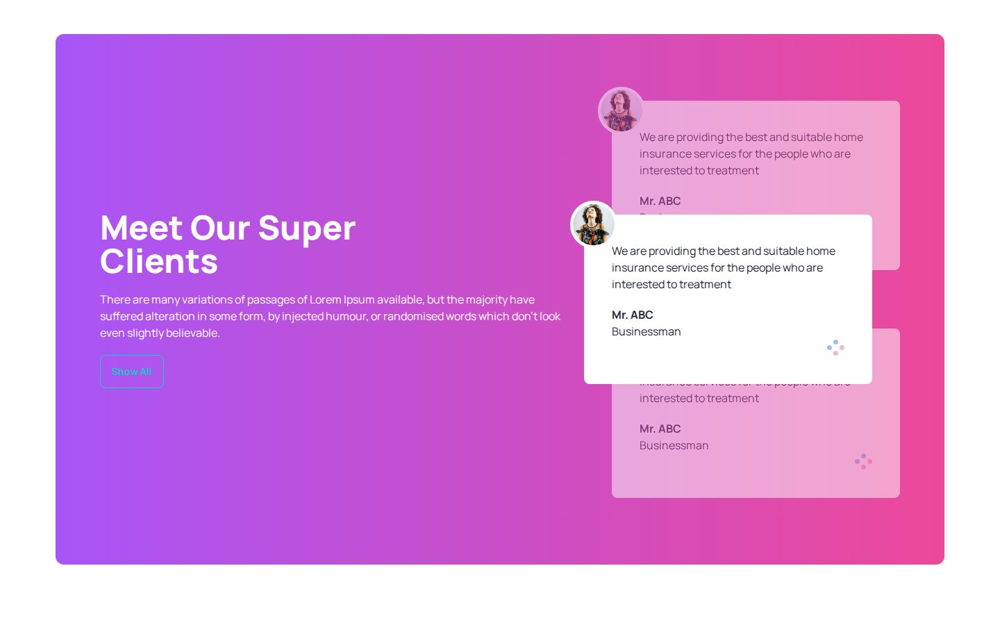
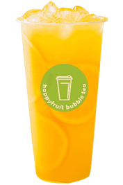

# ZenLeaf Tea Lounge

A tea shop landing page built with Tailwind CSS and DaisyUI: a hero with a rating badge, featured drinks, a brand story and customer reviews.

**Live site:** <https://shayan-abrar.github.io/ZenLeaf-Tea-Lounge/>

<p align="center">
  
</p>

<table>
  <tr>
    <td align="center" width="25%"><a href="screenshots/preview.png"></a><br><sub><b>Hero</b> · rating badge</sub></td>
    <td align="center" width="25%"><a href="screenshots/featured.jpg"></a><br><sub><b>Featured drinks</b></sub></td>
    <td align="center" width="25%"><a href="screenshots/fresh.jpg"></a><br><sub><b>Brand story</b> · image grid</sub></td>
    <td align="center" width="25%"><a href="screenshots/clients.jpg"></a><br><sub><b>Reviews</b></sub></td>
  </tr>
</table>

A café's landing page has to show its drinks, tell its story and show that customers like it. This page does that in four sections built almost entirely from Tailwind utility classes and a few DaisyUI components. The interesting parts are layout techniques: a product grid that changes its column count, a staggered image grid and overlapping review cards.

## Quick Start

```bash
git clone https://github.com/SHAYAN-ABRAR/ZenLeaf-Tea-Lounge.git
cd ZenLeaf-Tea-Lounge
python3 -m http.server 8000
```

Open <http://localhost:8000>. On Windows, use `python` instead of `python3`. Opening `index.html` directly in a browser works too. Tailwind CSS, DaisyUI, the Manrope font and the Font Awesome icons load from the internet.

## Features

- **Hero:** the headline "It's good tea time at The Tea House", an **Explore More** button, a drinks photo and a "5.00 Trust Pilot Rating" badge with a star icon.
- **Our Featured Products:** four drink cards in one, two or four columns depending on the screen width.
- **Great Tea, Freshly Presented:** a staggered grid of gradient tiles and drink photos next to a short brand story with "Unique Taste" and "Premium Quality" highlights.
- **Meet Our Super Clients:** a purple-to-pink gradient panel with three overlapping review cards. The outer two are faded so the middle one stands out.
- **Footer:** Services, Company and Legal link groups and a newsletter email field with a **Subscribe** button.

## Usage Example

The staggered image grid comes from `row-span-2` on the photo tiles. Each photo covers two rows of a two-column grid while each gradient tile takes one, so the two columns end up offset:

```html
<div class="grid gap-8 grid-cols-1 md:grid-cols-2 flex-1">
    <div class=" rounded-xl h-36 bg-gradient-to-r from-cyan-500 to-blue-500"></div>
    <div class="row-span-2 bg-[#e6a6231a] rounded-lg flex justify-center px-8 py-12"></div>
```

The review cards overlap because of negative margins (`-mb-20` and `-mt-20`), a relative offset (`right-10`) and `z-index` classes on the cards.

## Limitations

- Much of the content is placeholder text: all four products are "Milk Tea" with the same description, all three reviews repeat the same quote from "Mr. ABC", and the intro paragraphs are Lorem Ipsum.
- The buttons, footer links and newsletter form aren't connected to anything.
- On screens narrower than 416px, the rating badge covers part of the headline, and the hero is wider than the screen, so the page scrolls sideways.
- The product images have the alt text "Shoes", a leftover from a DaisyUI example. Six images in `images/`, `tailwind.config.js` and the `clifford` color in the inline config aren't used.

## Tech Stack

- HTML5
- Tailwind CSS (Play CDN) and DaisyUI 4.6.0: hero, card, button, input, join and footer components
- Google Fonts: Manrope
- Font Awesome, loaded through a Font Awesome Kit script, for the star icon
- Hosted on GitHub Pages

## Contributing

Suggestions and bug reports are welcome. Please [open an issue](https://github.com/SHAYAN-ABRAR/ZenLeaf-Tea-Lounge/issues). Please read the license note below before reusing any code or images.

## License

This repository doesn't have a license yet, so it doesn't grant anyone permission to reuse or redistribute its code or images. Please ask before reusing any part of it. The page's footer carries the line "© 2027 UIDesign.to - All rights reserved.", which suggests the design came from UIDesign.to.

---

Built by **Shayan Abrar** · [GitHub](https://github.com/SHAYAN-ABRAR) · [LinkedIn](https://www.linkedin.com/in/shayan-abrar/)
