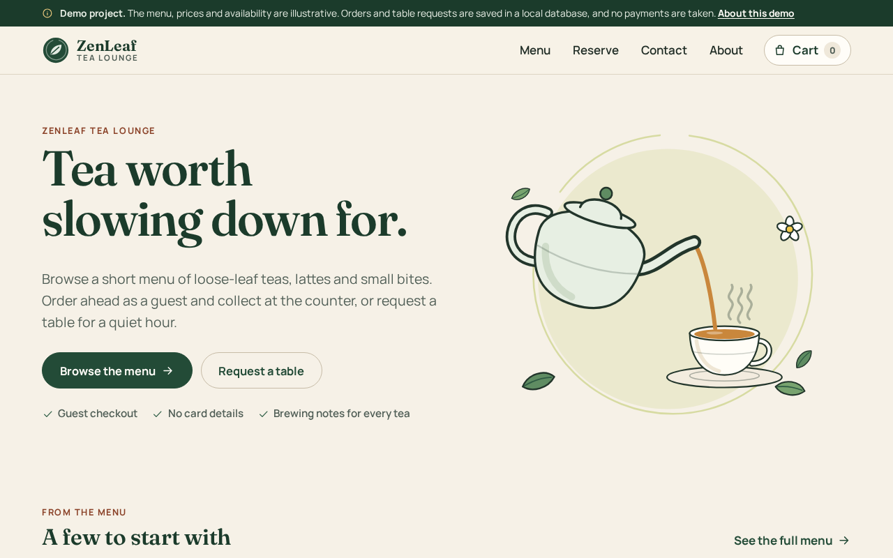
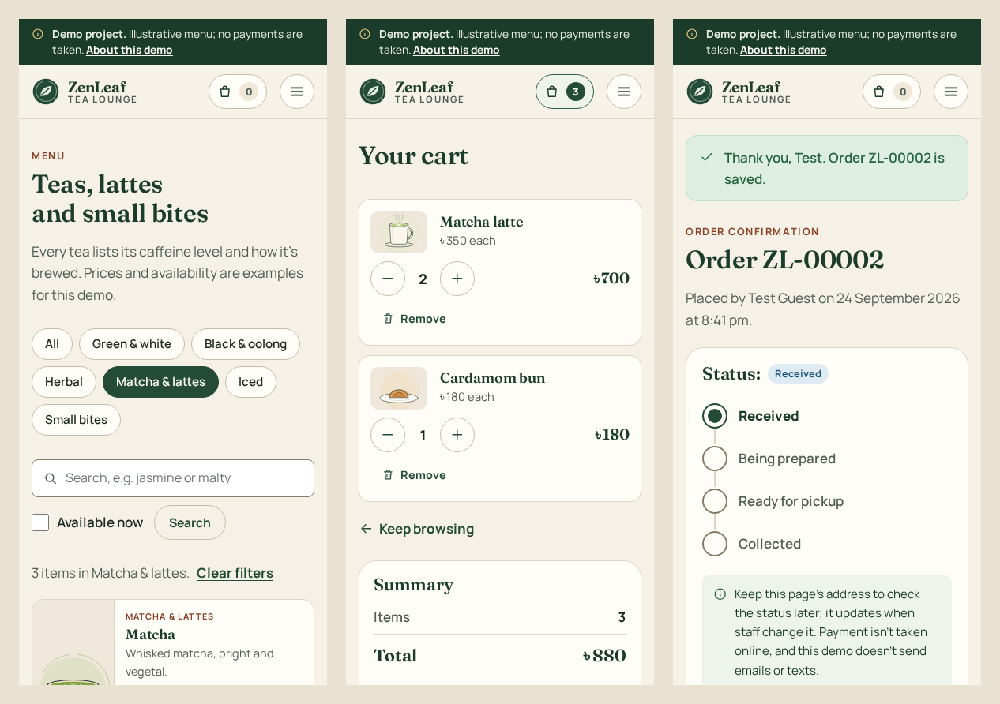
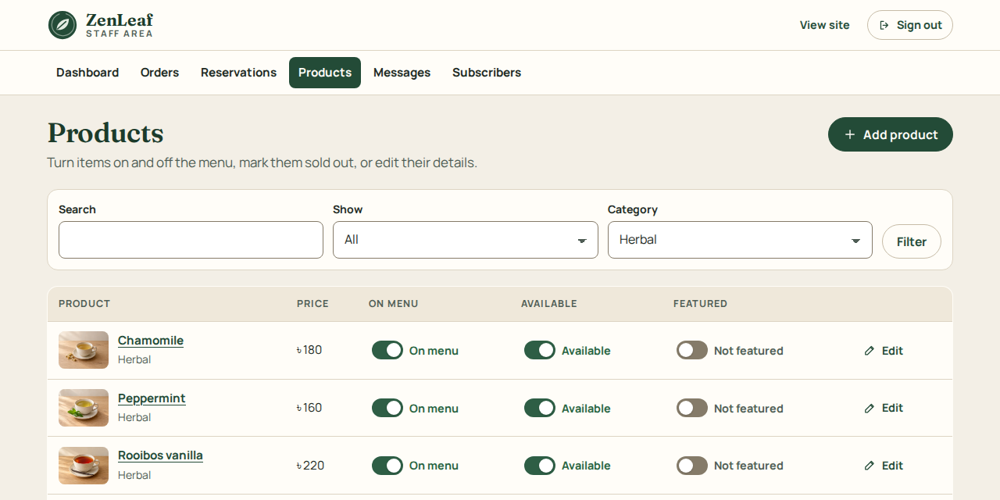

# ZenLeaf Tea Lounge

A small tea lounge website with a real backend. Guests browse a menu stored in SQLite, order ahead for pickup, request a table and send messages. Staff sign in to manage the menu and handle what comes in. It's built with Django.

**Live demo:** <https://shayan-abrar.github.io/ZenLeaf-Tea-Lounge/>

The live demo is a browser-only edition of the same site: it runs on GitHub Pages and saves everything in your own browser (see [The online demo](#the-online-demo)). The full version, with its SQLite backend and staff sign-in, runs on your computer.

ZenLeaf is a demo: the lounge, its menu and its prices are made up, and no payments are taken.

<p align="center">
  
</p>

<p align="center">
  
</p>

## What it does

**For guests**

- **Menu:** 21 demo items in six categories, each with a price, caffeine level, brewing notes and allergens. Filter by category, search, or show only what's available now. Sold-out items stay visible but can't be ordered.
- **Cart and guest checkout:** add items, change quantities and place a pickup order with a name and email. Every order gets a number such as `ZL-00001` and a private status page that follows it from Received to Collected. There's no payment step and no card field.
- **Table requests:** choose a date, time and party size. Requests start as **Pending** and change to Confirmed or Declined when staff answer. Guests can cancel from their request page.
- **Contact form and newsletter:** both save to the database, show clear success and error messages, and catch duplicates instead of saving them twice.

**For staff** (at `/staff/`; the full version requires sign-in)

- Add, edit, hide or delete products, and switch items between available and sold out.
- See orders and move them through Received, Being prepared, Ready for pickup, Collected or Cancelled, with an internal note.
- Confirm or decline table requests, with an optional message that the guest sees.
- Read contact messages and mark them handled. List newsletter subscribers and download them as CSV.

<p align="center">
  
</p>

## Run it locally

You need **Python 3.10 or newer** and **Git**.

**macOS and Linux**

```bash
git clone https://github.com/SHAYAN-ABRAR/ZenLeaf-Tea-Lounge.git
cd ZenLeaf-Tea-Lounge
python3 bootstrap.py
.venv/bin/python manage.py runserver
```

**Windows (PowerShell)**

```powershell
git clone https://github.com/SHAYAN-ABRAR/ZenLeaf-Tea-Lounge.git
cd ZenLeaf-Tea-Lounge
py bootstrap.py              # or: python bootstrap.py
.venv\Scripts\python manage.py runserver
```

Then open <http://127.0.0.1:8000/>. The staff area is at <http://127.0.0.1:8000/staff/>.

`bootstrap.py` is safe to run again. Each time, it:

1. creates a virtual environment in `.venv` if there isn't one,
2. installs Django and WhiteNoise from `requirements.txt`,
3. creates `.env` from `.env.example` with a new random secret key (an existing `.env` is never overwritten),
4. applies the database migrations,
5. loads the demo menu if the database has no products yet,
6. offers to create a staff account if none exists.

On Debian or Ubuntu, if step 1 fails, install the venv module with `sudo apt install python3-venv` and run it again.

<details>
<summary>Setting up by hand instead</summary>

```bash
python3 -m venv .venv
.venv/bin/python -m pip install -r requirements.txt
cp .env.example .env
.venv/bin/python -c "import secrets; print(secrets.token_urlsafe(50))"
```

Paste the printed value into `.env` after `DJANGO_SECRET_KEY=`, then:

```bash
.venv/bin/python manage.py migrate
.venv/bin/python manage.py seed_demo
.venv/bin/python manage.py createsuperuser
.venv/bin/python manage.py runserver
```

On Windows, use `py -m venv .venv`, `copy .env.example .env` and `.venv\Scripts\python` in place of `.venv/bin/python`.

</details>

## The online demo

<https://shayan-abrar.github.io/ZenLeaf-Tea-Lounge/> shows the same pages without a server, because GitHub Pages can only serve files. What's different:

- Your cart, orders, table requests, messages and sign-ups are saved in your browser's local storage instead of a database. Each visitor has their own copy, and nobody else sees what you enter.
- The staff area opens without a password, so you can try both sides: place an order, then update it as staff and watch the order page change. It only changes the data in your own browser. The full version asks staff to sign in.
- **Reset the demo** on the About page or the staff dashboard clears your data and restores the menu. Clearing the site's data in your browser does the same.
- It needs JavaScript. Some private windows block local storage; the demo then warns you and forgets your changes when you leave the page.

`manage.py build_demo` renders the site's own templates into static HTML, with the demo menu from `lounge/seed_data.py`. In the browser, `lounge/static/lounge/js/demo.js` fills in the data and follows the same rules and messages as the Django forms. On every push to `main`, the workflow in `.github/workflows/pages.yml` runs the tests, builds the demo and publishes it. For that, GitHub Pages must be set to deploy from GitHub Actions (**Settings → Pages → Build and deployment → Source: GitHub Actions**), a one-time setting.

To preview the online demo on your computer:

```bash
.venv/bin/python manage.py build_demo --output _site
.venv/bin/python -m http.server 8001 --directory _site
```

Then open <http://127.0.0.1:8001/> (on Windows, use `.venv\Scripts\python`).

## Staff accounts

There's no built-in account or default password. Create one yourself:

```bash
.venv/bin/python manage.py createsuperuser
```

You choose the username and password when prompted (on Windows, use `.venv\Scripts\python`). Any account with staff status can sign in at `/staff/`. After 5 failed attempts for the same username from the same address, sign-in pauses for 15 minutes; both numbers can be changed in `.env`. To change a password later, run `manage.py changepassword <username>`.

## Where the data lives

Everything is stored in one SQLite file on the server: **`data/zenleaf.sqlite3`**. The `ZENLEAF_DB_PATH` setting in `.env` can point it elsewhere, and the folder is created if it's missing. It holds the menu, orders, table requests, messages, subscribers, staff accounts and sessions. Carts live in the visitor's session, which is stored in the same database; the browser only keeps a session cookie.

The database runs in SQLite's WAL mode, so while the site is running you'll also see `zenleaf.sqlite3-wal` and `zenleaf.sqlite3-shm` next to it. They're part of the database; don't delete them while the server runs.

`data/`, `backups/`, `.env` and `.venv/` are listed in `.gitignore`, so the database, backups and secrets stay out of Git.

**Start over with an empty database:** stop the server, delete `data/zenleaf.sqlite3` and its `-wal` and `-shm` files, and run `bootstrap.py` again.

## The demo menu

The first time `python bootstrap.py` runs, it loads six categories and 21 products from `lounge/seed_data.py` with `manage.py seed_demo`. Two of them start as sold out and four are featured on the home page. Later runs of `bootstrap.py` leave the menu alone, so products you delete in the staff area stay deleted.

- `manage.py seed_demo` adds any demo items that are missing, including ones deleted in the staff area. It keeps your edits to the others.
- `manage.py seed_demo --reset` (or `bootstrap.py --reset-menu`) also puts the demo items' prices, text and availability back to their original values. Orders, requests and messages aren't touched.

Every seeded item is illustrative. The names describe common styles of tea, not teas from a particular place, and the site says on every page that the menu and prices are examples. The site has no reviews, ratings, testimonials, street address or opening-hours promise, because there's no real lounge behind it.

## Backups

```bash
.venv/bin/python manage.py backup_db
```

This writes a copy to `backups/zenleaf-YYYYMMDD-HHMMSS.sqlite3` using SQLite's online backup API, so it's safe while the site is running. It then checks the copy's integrity. Add `--keep 7` to keep only the seven newest backups, or `--output some/file.sqlite3` to choose the file. Copying `zenleaf.sqlite3` by hand while the server runs can miss recent changes that are still in the `-wal` file.

To restore, stop the server and run:

```bash
.venv/bin/python manage.py restore_db backups/zenleaf-YYYYMMDD-HHMMSS.sqlite3
```

It checks that the file is a ZenLeaf database, asks for confirmation (`--yes` skips the question), and saves the current database as `backups/before-restore-….sqlite3` before replacing it.

## Settings

All settings are read from `.env` (real environment variables take priority). `.env.example` lists and explains each one. The ones you're most likely to change:

| Setting | Default | What it does |
| --- | --- | --- |
| `DJANGO_SECRET_KEY` | random, written by `bootstrap.py` | Signs sessions and security tokens. Required; keep it secret. |
| `DJANGO_DEBUG` | `false` | `true` shows Django's detailed error pages while you develop. |
| `ZENLEAF_DB_PATH` | `data/zenleaf.sqlite3` | Location of the SQLite file. |
| `ZENLEAF_TIME_ZONE` | `Asia/Dhaka` | Used for dates and for checking that table requests aren't in the past. |
| `ZENLEAF_CURRENCY_SYMBOL` | `৳` | Shown next to prices. |
| `ZENLEAF_OPENING_TIME` / `ZENLEAF_LAST_SEATING` | `10:00` / `20:00` | The times offered on the table request form. |
| `ZENLEAF_MAX_PARTY_SIZE` | `8` | Largest party the request form accepts. |

## Tests

```bash
.venv/bin/python manage.py test
```

The 57 tests run against a temporary in-memory database and cover:

- the migrations, the demo seed, order numbering and pricing, and backup and restore;
- menu filters, the cart, checkout, the check that one checkout page can't create two orders, and malformed requests;
- table request rules, contact and newsletter duplicates, and the error pages;
- staff sign-in, lockout, permissions and CSRF protection, the CSV export, and staff updates showing up on guest pages;
- the online demo build: every page written under the Pages address, with no server-only values in the files;
- the menu pictures: every listed photo present at both sizes, photos on the menu, cart and staff pages, and the drawing when an item has no photo.

## How it's built

- **Django 5.2** renders every page on the server and talks to SQLite through migrations. The site works without JavaScript; with JavaScript, adding to the cart, newsletter sign-up and the staff switches update in place without reloading.
- **WhiteNoise** serves the CSS, JavaScript, fonts and images, even with debug mode off.
- **No front-end build step.** It's plain CSS and a few small scripts, and the fonts are included in the repository.
- **Accessibility:** labelled form fields with linked error messages, an error summary that receives focus, a skip link, visible focus outlines, keyboard-operable menus and switches, reduced-motion support, and layouts checked from 320 px to 1440 px wide.

```
zenleaf/                   Django project: settings (read from .env), URLs, security headers
lounge/                    the app: models, views, forms, templates, static files, tests
lounge/management/         seed_demo, backup_db, restore_db and build_demo commands
lounge/templates/demo/     pages of the online demo
lounge/static/lounge/js/   site.js for the full site, demo.js for the online demo
lounge/static/lounge/img/  logo, hero, menu drawings (menu/) and menu photos (menu/photos/)
.github/workflows/         builds and publishes the online demo on GitHub Pages
tools/                     scripts that draw the SVG illustrations and prepare the menu photos
docs/                      screenshots, the asset audit and the photo prompts
bootstrap.py               one-command local setup
```

If you edit CSS or JavaScript while the server runs with `DJANGO_DEBUG=false`, restart the server to see the change.

## Deploying the full version

The online demo publishes itself (see above), but the full version with its SQLite backend hasn't been deployed anywhere. GitHub Pages can't host it, because Pages can't run Django or write to a database. A deployment would need:

- **A host that runs Python**, such as a small virtual server or a platform that runs Python web apps.
- **Persistent storage for the SQLite file.** Many platforms reset their disk on every deploy or restart, which would erase orders and requests. Point `ZENLEAF_DB_PATH` at a persistent disk or volume.
- **A production web server** such as Gunicorn (or Waitress on Windows) in place of `runserver`, behind HTTPS.
- **Production settings:** a new `DJANGO_SECRET_KEY`, `DJANGO_DEBUG=false`, the real domain in `DJANGO_ALLOWED_HOSTS` and `DJANGO_CSRF_TRUSTED_ORIGINS`, `DJANGO_HTTPS=true`, and `DJANGO_BEHIND_PROXY=true` when a proxy handles HTTPS.
- **`manage.py collectstatic`** during each deploy.
- **Scheduled backups** with `backup_db`, copied off the server.
- **One server process at a time,** or a move to PostgreSQL and a shared cache. SQLite and the in-memory sign-in lockout counter assume a single server.

Taking real orders would also need things this demo doesn't have: a payment provider, email or SMS notifications, a privacy notice, and real business details.

## Limitations

- It's a demo. No payments are taken and no emails or texts are sent; guests keep their private status link instead.
- The online demo keeps data only in each visitor's browser, and its staff area is open to anyone who visits it.
- Table requests aren't checked against capacity. Staff confirm or decline each one.
- There are no customer accounts. Anyone with an order's or request's private link can view it.
- The menu has a single currency and no taxes, discounts or order-ahead time slots.
- The fonts include Latin characters only, so other scripts fall back to system fonts.

## Credits and license

The menu photos, illustrations, icons and copy were made for this project; [THIRD_PARTY_NOTICES.md](THIRD_PARTY_NOTICES.md#menu-photos) says how the photos were made. The fonts are [Fraunces](https://github.com/undercasetype/Fraunces) and [Manrope](https://github.com/sharanda/manrope) under the SIL Open Font License 1.1; their license texts are in `lounge/static/lounge/fonts/`. See [THIRD_PARTY_NOTICES.md](THIRD_PARTY_NOTICES.md) for details, and [docs/asset-audit.md](docs/asset-audit.md) for what happened to the earlier page's template, images and copy. None of them are used here.

This repository doesn't have a license yet, so it doesn't grant permission to reuse or redistribute its code. Please ask before reusing any part of it.

---

Built by **Shayan Abrar** · [GitHub](https://github.com/SHAYAN-ABRAR) · [LinkedIn](https://www.linkedin.com/in/shayan-abrar/)
